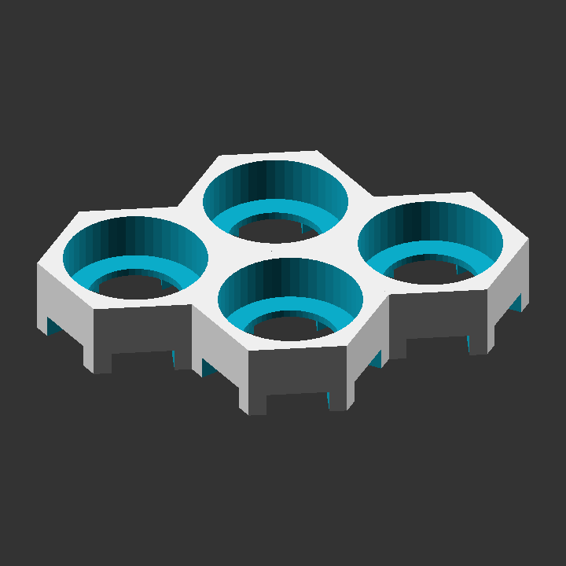
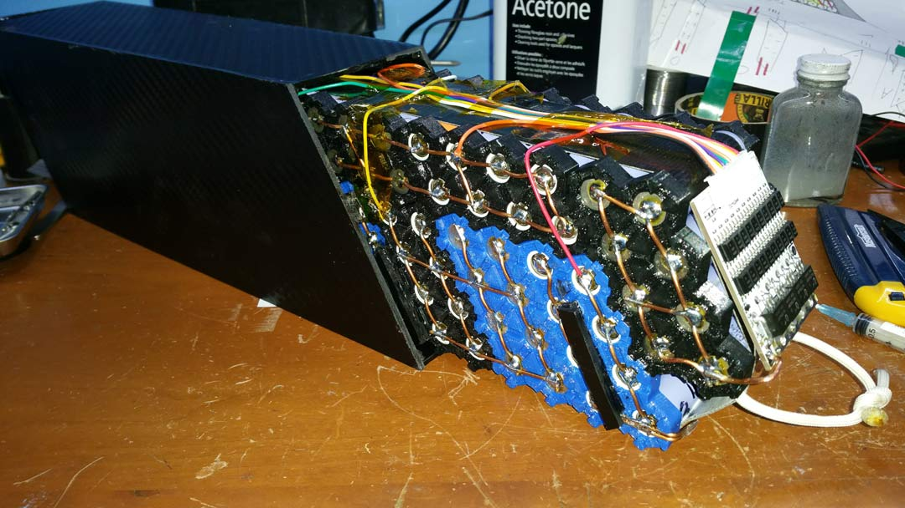
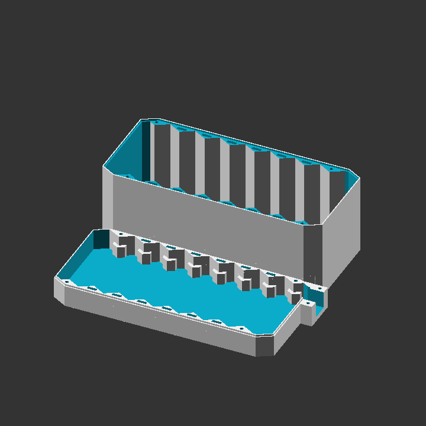
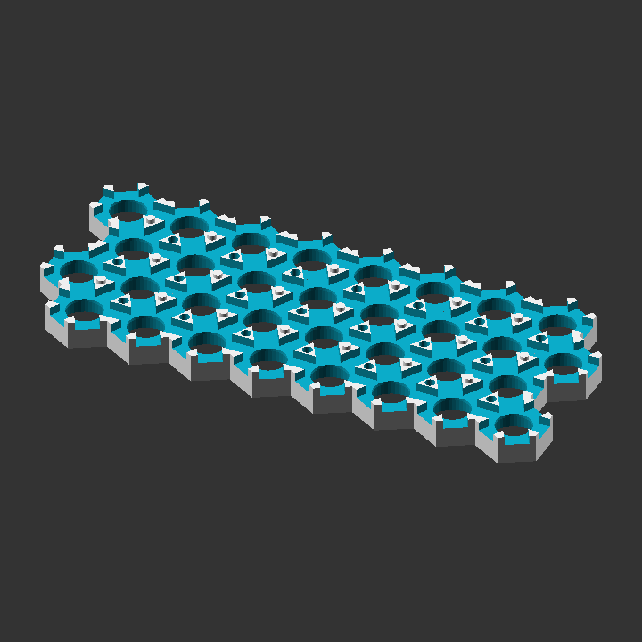

# Hex-Cell-Holder
A parametric OpenSCAD project to generate STLs models of hexagonal lithium cell holders, boxes, and caps to be 3d printed.

8p Packs for an ebike

Box made of ABS sheet

10s and a 2s box connected in series.

Large A123 Lifepo4 cells

Part of a Battery for the Soco TC motocycle

## How does it work?
Hex-Cell-Holder uses OpenSCAD to create solid 3D CAD objects. Openscad allows easy parametric configuration of a 3d model which means you don't need to be a coder to create a specific model that you need.

http://www.openscad.org/

## Who should use this?
This project was primarily created to make lithium ion packs out of 18650 for ebikes with the help of a 3d printer. You can make **any size** pack you want out of **any size** cylindrical lithium cell. 

## Holders

You can generate a holder of any number of rows, columns, rectangular or parallelogram, and strip or bus. Below is an example configuration.
Check the console for extra information like whether or not you need a mirrored holder or total widths or lengths.

## Caps

Caps can be generated to fit over the holders for when you don't need a full box to house the pack but still want the terminals safely covered.

## Boxes and wire clamp

Your battery pack can be put into a box to be fully enclosed and protected. There is also a wire clamp for your bulk leads to provide some strain relief. The box has many options so read through the config to see what you can do.
## Printing an insulator as support

This option allows you to print the support you would normally have to remove as a insulator to put over the strips afterwards for extra protection.
It is very easy to remove and I would recommend enabling it for that reason alone however it will use up more plastic.

# Fit test
fit_test.scad generates holders to test fit which cell_dia to use for the holders.

# Bat scripts to generate stls
Bat files are added to quickly generate multiple stls. This saves a lot of time by not having to change part_type and part, rendering, and then exporting as an stl for each piece.

# Experimental features
## Vertical Holder and Box Stacking
There are some options for stacking packs vertically. Stacking pins/holes allow holders to stack into each other. Stacking bolts create holes in the holders so the entire pack can be bolted together. Please read safety issues with these experimental options in the openscad file.

You can print out vertical box sections which increase the box height by one stack each.
